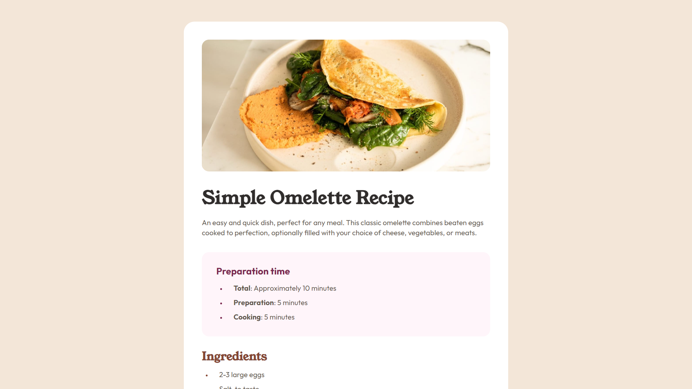

# Frontend Mentor - Recipe page solution

This is a solution to the [Recipe page challenge on Frontend Mentor](https://www.frontendmentor.io/challenges/recipe-page-KiTsR8QQKm). Frontend Mentor challenges help you improve your coding skills by building realistic projects. 

## Table of contents

- [Overview](#overview)
  - [The challenge](#the-challenge)
  - [Screenshot](#screenshot)
  - [Links](#links)
- [My process](#my-process)
  - [Built with](#built-with)
  - [What I learned](#what-i-learned)
  - [Useful resources](#useful-resources)
- [Author](#author)
- [Acknowledgments](#acknowledgments)

## Overview

### Screenshot

### Links

- Solution URL: [GitHub](https://github.com/shwerts/recipe-page-main)
- Live Site URL: [GitHub Pages](https://shwerts.github.io/recipe-page-main/)

## My process

### Built with

- Semantic HTML5 markup
- CSS custom properties
- Flexbox

### What I learned

Basics of styling tables using CSS

### Useful resources

- [MDN seb docs](hhttps://developer.mozilla.org/en-US/docs/Learn/CSS/Building_blocks/Styling_tables) - I found out about styling tables thanks to this page

## Author

- Frontend Mentor - [@shwerts](https://www.frontendmentor.io/profile/shwerts)

## Acknowledgments

Shortly, anyone can leave some tips and notes for my solution
